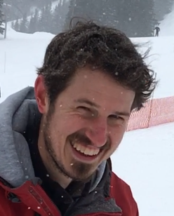

Explanation is a topic of longstanding interest in philosophy and psychology, and has recently attracted renewed attention due to novel challenges in interpreting and interacting with relatively opaque AI systems. In this graduate seminar, we will study the science and engineering of explanations, combining perspectives from philosophy, psychology, AI, and the legal sciences. We will ask questions like: When do we ask for explanations? What makes a good explanation? How can we build machines that can understand and explain? This interdisciplinary seminar is co-taught by Thomas Icard (Philosophy) and Tobias Gerstenberg (Psychology). We will meet twice a week (Tuesdays and Thursdays 10:30am-11:50am) to discuss research articles from a range of disciplines. Students are expected to write responses based on their readings, lead the discussion on one of the papers, and actively participate in the discussion otherwise. As a final project, students will outline a novel study on explanation that makes an empirical, modeling, or theoretical contribution. Participation is restricted to a maximum of 12 graduate students.

If you're interested in taking this class, please fill out the course application form [here](https://forms.gle/Te9EQtkhcnyL3PST8).

### Instructor info

[Tobi Gerstenberg](http://cicl.stanford.edu/member/tobias_gerstenberg), Assistant Professor of Cognitive Psychology

__Office hours__: Tuesday 1-2pm

__Email__: gerstenberg@stanford.edu

[Thomas Icard](https://web.stanford.edu/~icard/), Assistant Professor of Philosophy and Computer Science (by courtesy)

__Office hours__:  

__Email__: icard@stanford.edu

### Schedule

The class meets on Tuesdays and Thursdays from 10:30am to 11:50am. The readings will be made available through [Canvas](https://canvas.stanford.edu/). 

#### Week 1: Background 

- __9/15__: [Woodward, J. (Winter 2019 Edition) Scientific Explanation, _The Stanford Encyclopedia of Philosophy_, Edward N. Zalta (ed.).](https://plato.stanford.edu/entries/scientific-explanation/)
- __9/17__: Lombrozo, T. & Vasilyeva, N. (2017). Causal explanation. _Oxford Handbook of Causal Reasoning_, 415-432. 

#### Week 2: Explanation and understanding in science

- __9/22__: Trout, J. D. (2007). The Psychology of Scientific Explanation. _Philosophy Compass_, 2(3), 564-591.
- __9/24__: Grimm, S. R. (2010). The goal of explanation. _Studies in History and Philosophy of Science Part A_, 41(4), 337-344.

#### Week 3: Individual-level function of explanation

- __9/29__: Lombrozo, T. (2006). The structure and function of explanations. _Trends in Cognitive Sciences_, 10(10), 464-470. 

- __10/1__: Liquin, E. G. & Lombrozo, T. (2020). A functional approach to explanation-seeking curiosity. _Cognitive Psychology_, 119, 101276.

#### Week 4: Communication

- __10/6__: Hilton, D. J. (1990). Conversational processes and causal explanation. _Psychological Bulletin_, 107(1), 65-81. 
	+ optional:  Turnbull, W. (1986). Everyday explanation: The pragmatics of puzzle resolution. _Journal for the Theory of Social Behaviour_, 16(2), 141-160. 
- __10/8__: [Kirfel, L., Icard, T. F., & Gerstenberg, T. (2020). Inference from explanation. _PsyArXiv_.](https://psyarxiv.com/x5mqc) 
	+ optional: Potochnik, A. (2016). Scientific explanation: Putting communication first. _Philosophy of Science_, 83(5), 721-732. 

#### Week 5: Formal theories of explanation 

- __10/13__: Halpern, J. Y. & Pearl, J. (2005). Causes and explanations: A structural-model approach. Part II: Explanations. _The British Journal for the Philosophy of Science_, 56(4), 889-911. 

- __10/15__: Bareinboim, E., Correa, J., Ibeling, D., & Icard, T. (2020). <a href="https://causalai.net/r60.pdf">On Pearl's hierarchy and the foundations of causal inference</a>. _Probabilistic and Causal Inference: The Works of Judea Pearl_, 40(1), 75-149. 

#### Week 6: NLP & Vision

- __10/20__: Hancock, B., Bringmann, M., Varma, P., Liang, P., Wang, S., & Ré, C. (2018). Training classifiers with natural language explanations. In Proceedings of the conference. _Association for Computational Linguistics Meeting_ (pp. 1884). 
	+ optional: Murty, S., Koh, P. W., & Liang, P. (2020). ExpBERT: Representation Engineering with Natural Language Explanations. _arXiv preprint_ arXiv:2005.01932. 
	+ optional: Vig, J., Gehrmann, S., Belinkov, Y., Qian, S., Nevo, D., Singer, Y., & Shieber, S. (2020). Causal mediation analysis for interpreting neural nlp: The case of gender bias. _arXiv preprint_ arXiv:2004.12265. 
- __10/22__: Hendricks, L. A., Akata, Z., Rohrbach, M., Donahue, J., Schiele, B., & Darrell, T. (2016). Generating visual explanations. In _European Conference on Computer Vision_ (pp. 3-19).  
	+ optional: Hendricks, L. A., Hu, R., Darrell, T., & Akata, Z. (2018). Grounding visual explanations. In _European Conference on Computer Vision_ (pp. 269-286). 

#### Week 7: Reinforcement learning and action

- __10/27__: Buesing, L., Weber, T., Zwols, Y., Racaniere, S., Guez, A., Lespiau, J.-B., & Heess, N. (2018). Woulda, coulda, shoulda: Counterfactually-guided policy search. _arXiv preprint_ arXiv:1811.06272. 
	+ optional: Schulam, P. & Saria, S. (2017). Reliable decision support using counterfactual models. In _Advances in Neural Information Processing Systems_ (pp. 1697-1708). 
	+ optional: Oberst, M. & Sontag, D. (2019). Counterfactual off-policy evaluation with Gumbel-Max structural causal models. _arXiv preprint_ arXiv:1905.05824. 
- __10/29__: Karimi, A.-H., Schölkopf, B., & Valera, I. (2020). Algorithmic recourse: From counterfactual explanations to interventions. _arXiv preprint_ arXiv:2002.06278. 
	+ optional: Venkatasubramanian, S. & Alfano, M. (2020). The philosophical basis of algorithmic recourse. In _Proceedings of the 2020 Conference on Fairness, Accountability, and Transparency_ (pp. 284--293). 

#### Week 8: Legal dimensions

- __11/3__: Wachter, S., Mittelstadt, B., & Russell, C. (2017). Counterfactual explanations without opening the black box: Automated decisions and the GDPR. _SSRN Electronic Journal_. 
	+ optional: Mittelstadt, B., Russell, C., & Wachter, S. (2019). Explaining explanations in AI. In _Proceedings of the conference on fairness, accountability, and transparency_ (pp. 279--288). 
- __11/5__: Doshi-Velez, F., Kortz, M., Budish, R., Bavitz, C., Gershman, S., O'Brien, D., Schieber, S., Waldo, J., Weinberger, D., & Wood, A. (2017). Accountability of AI under the law: The role of explanation. _arXiv preprint_ arXiv:1711.01134. 
	+ optional: Narayanan, M., Chen, E., He, J., Kim, B., Gershman, S., & Doshi-Velez, F. (2018). How do humans understand explanations from machine learning systems? an evaluation of the human-interpretability of explanation. _arXiv preprint_ arXiv:1802.00682. 

#### Week 9: TBD 

- __11/10__
- __11/12__

#### Week 10: Project presentations

- __11/17__ 
- __11/19__

### General information

#### What to expect? 

In ["A Vision for Stanford"](https://ourvision.stanford.edu/), university president Marc Tessier-Lavigne states that Stanford wants to be 

>"an inspired, inclusive and collaborative community of diverse scholars, students and staff, where all are supported and empowered to thrive." 

Let's try our best together in this seminar to make this happen! 

##### What you can expect from us

_We will ..._

- provide an introduction to the philosophy and psychology of explanation in Week 1. 
- help facilitate the discussion in subsequent sessions. 
- provide feedback on your final papers. 
- be available to meet during office hours. 
- send announcements via Canvas to guide the reading for each upcoming week. 

##### What we expect from you 

_You will ..._

- attend all of [the classes](#schedule) and participate in class discussion.
- lead the discussion for one class. 
- write short [reaction papers](#reaction-posts) based on the readings and upload each paper on Canvas by 10pm (at the latest) the night before class. 
- write a final paper (#final-paper). 
- present your final paper in class in Week 10. 
- students who audit the class are expected to write reaction posts and participate in discussion in class. 

#### Grading 

- 25% final paper
- 25% leading discussion 
- 25% reaction posts to readings
- 25% participation and discussion in class

##### Final paper

The final project may be one of the following three: 

1. An empirical project proposal. 
2. A literature review based on one of the class topics. 
3. A theoretical essay. 

The final paper (1000--2000 words) will be due on __November, 19th at 10pm__. 

##### Reaction posts 

Here are some guiding thoughts on how to write a good reaction post: 

- Structure your posts (headings, subheadings, etc.). 
- Express your opinion rather than summarize the paper(s).
- Try to connect the ideas expressed in the paper to concrete every-day experiences. 
- Identify strengths and weaknesses of the paper. 
- Relate different papers to each other. 
- Ask questions that go beyond what the paper discusses (what's missing, where should we go next)? 

The reaction posts should be concise (one or two paragraphs per paper), and are due the night before class (submitted via Canvas).  

#### Policies 

Please familiarize yourself with [Stanford's honor code](https://communitystandards.stanford.edu/policies-and-guidance/honor-code). We will adhere to it and follow through on its penalty guidelines.  

#### Support 

Students who may need an academic accommodation based on the impact of a disability must initiate the request with the Office of Accessible Education
([OAE](https://oae.stanford.edu/)). Professional staff will evaluate the request with required documentation, recommend reasonable accommodations, and prepare an Accommodation Letter for faculty dated in the current quarter in which the request is being made. Students should contact the OAE as soon as possible since timely notice is needed to coordinate accommodations. The OAE is located at 563 Salvatierra Walk (phone: 723-1066, URL: http://oae.stanford.edu).  

Stanford is committed to ensuring that all courses are financially accessible to its students. If you require assistance with the cost of course textbooks, supplies, materials and/or fees, you should contact the Diversity & First-Gen Office ([D-Gen](https://diversityandfirstgen.stanford.edu/)) at opportunityfund@stanford.edu to learn about the FLIbrary and other resources they have available for support. 

Stanford offers several tutoring and coaching services: 

- [Academic Skills Coaching](https://learningconnection.stanford.edu/academic-skills-coaching)
- [Tutor for learning differences](https://slc.stanford.edu/slc-services/tutor-connection-service-0)
- [English language learners](https://teachingcommons.stanford.edu/teachingwriting/pwr-guide/teaching-multilingual-students/hume-center-support-ells)
- [Hume Center for Writing and Speaking](https://undergrad.stanford.edu/tutoring-support/hume-center)

#### Feedback 

We welcome feedback regarding the course at any point. Please feel free to talk with us after class, come to office hours, email us, or leave anonymous feedback using this [online form](https://forms.gle/FSjFGuqbD2MjGwG39). 

